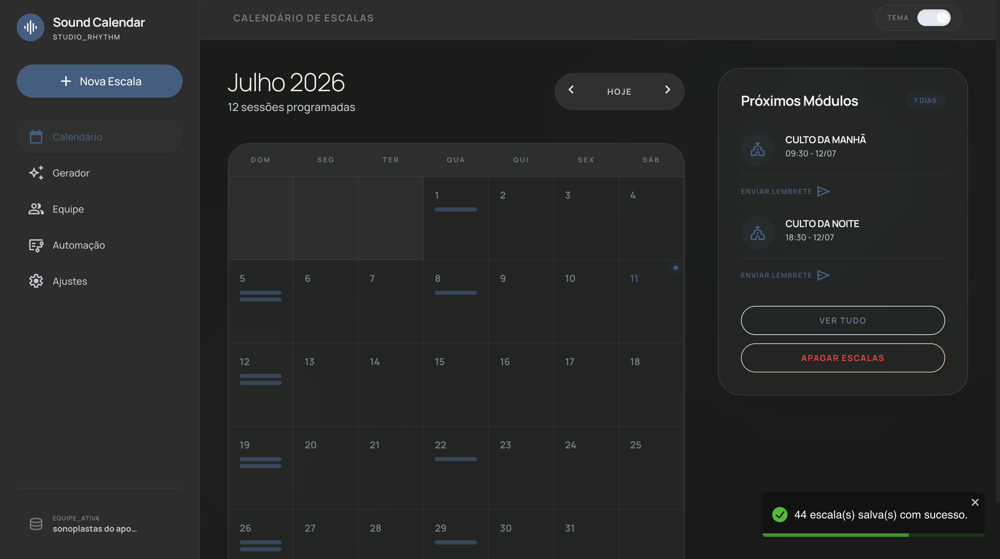
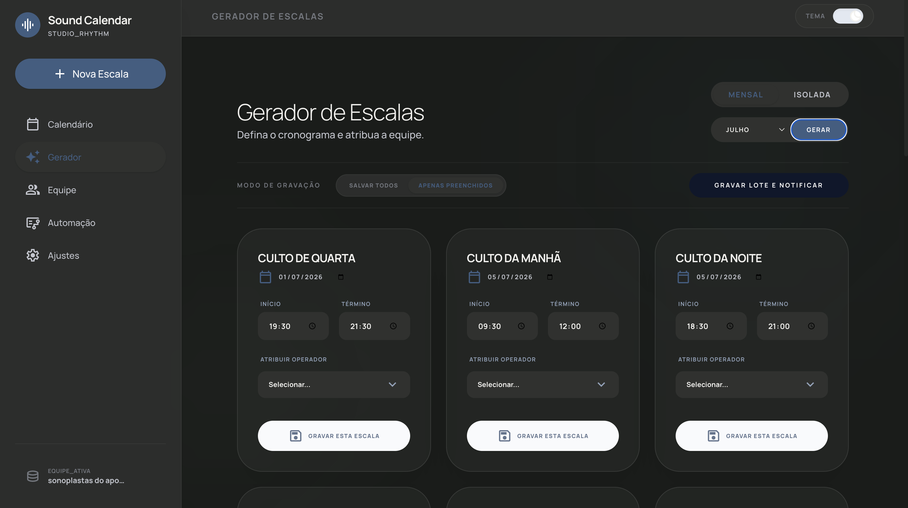
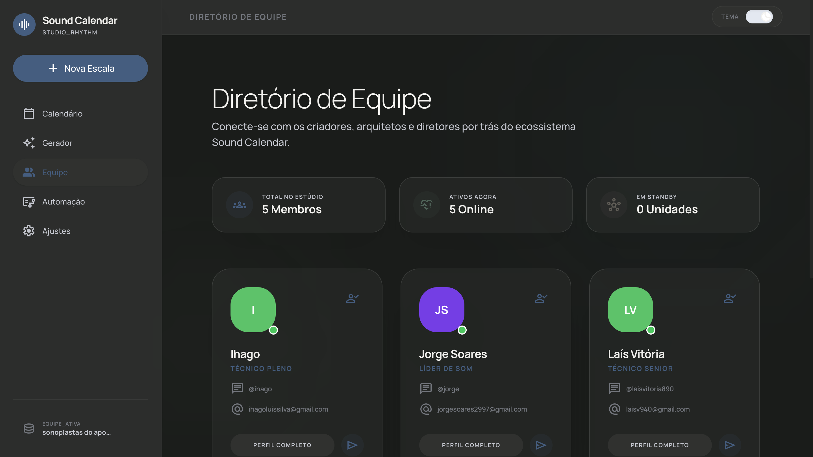
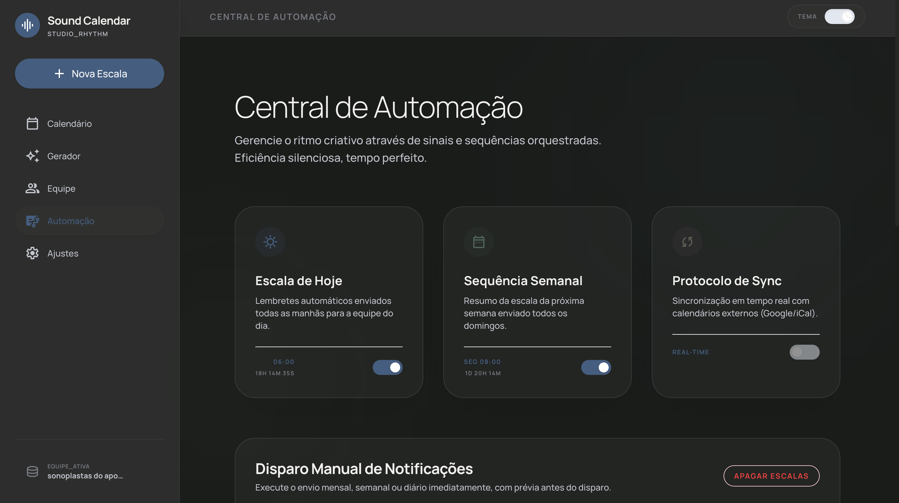
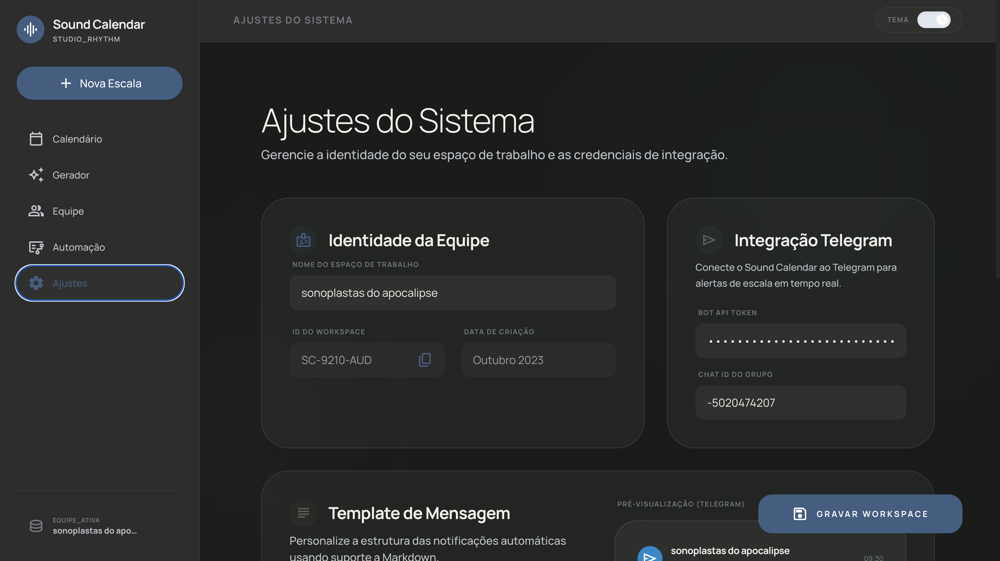

<div align="center">
  
</div>


<h1 align="center">Sound Calendar</h1>

<div align="center">
  <a href="https://github.com/jorgesoares2997/sound-calendar/actions/workflows/ci.yml">
    
  </a>
</div>

## 🎯 O problema que o projeto resolve
A gestão de escalas para equipes de áudio, som e mídia em eventos ou igrejas frequentemente sofre com falhas de comunicação, esquecimentos e processos manuais exaustivos. O **Sound Calendar** centraliza o controle de membros, turnos e configurações da equipe em uma plataforma única. Seu maior diferencial é a **automação proativa**: o sistema notifica automaticamente os membros da equipe através do Telegram e E-mail, eliminando a necessidade do líder cobrar cada pessoa individualmente e garantindo que ninguém perca seu turno de operação.

## 🛠 Tecnologias utilizadas
- **Frontend & UI**: [Next.js (v16)](https://nextjs.org/), [React (v19)](https://react.dev/)
- **Linguagem**: [TypeScript](https://www.typescriptlang.org/)
- **Estilização & Componentes**: [Tailwind CSS (v4)](https://tailwindcss.com/), [Lucide React](https://lucide.dev/) para ícones, e `react-toastify` para feedbacks visuais.
- **Backend & Banco de Dados**: [Supabase](https://supabase.com/) (PostgreSQL) integrado via Next.js Server Actions.
- **Integrações & Comunicação**: API do **Telegram Bot** e **Nodemailer** para disparos de e-mail.
- **Automação de Tarefas**: Vercel Cron Jobs para agendamento e execução de rotinas automáticas de notificação.

## 🚀 Como rodar ou acessar o projeto

### Pré-requisitos
- Node.js e `pnpm` instalados
- Conta no Supabase
- Bot criado no Telegram (via BotFather)

### Instalação e Execução local

1. Clone o repositório e instale as dependências:
   ```bash
   pnpm install
   ```

2. Crie o arquivo `.env.local` na raiz do projeto:
   ```env
   NEXT_PUBLIC_SUPABASE_URL=
   SUPABASE_SERVICE_ROLE_KEY=
   SUPABASE_URL=
   TELEGRAM_BOT_TOKEN=
   TELEGRAM_CHAT_ID=
   SMTP_HOST=
   SMTP_PORT=587
   SMTP_USER=
   SMTP_PASS=
   SMTP_FROM=
   NEXT_PUBLIC_TEAM_NAME=Sound Team
   ```

3. Inicie o servidor de desenvolvimento:
   ```bash
   pnpm dev
   ```

### Setup do Banco de Dados (Supabase)
1. Crie um projeto no Supabase e copie suas credenciais.
2. Linke o projeto local e rode as migrações:
   ```bash
   pnpm dlx supabase login
   pnpm dlx supabase link --project-ref <SEU_PROJECT_REF>
   pnpm dlx supabase db push
   ```
3. *Opcional*: Migre dados antigos (caso existam) usando `pnpm db:migrate-json`.

### Testes Automatizados (Jest)
O projeto conta com uma esteira de CI/CD no GitHub Actions que valida automaticamente o código. A infraestrutura de testes unitários foi implementada com Jest e React Testing Library, focada em garantir a estabilidade das lógicas de estado e formatação do Telegram.

Para rodar a suíte de testes localmente:
```bash
npm run test
```
Para executar em modo contínuo de observação (watch):
```bash
npm run test:watch
```

### Automação de Notificações
O sistema possui rotinas configuradas no `vercel.json` para disparar via Vercel Cron:
- **Semanal**: Toda segunda-feira às 06:00 (UTC) via `/api/notify/weekly`
- **Diário**: Todos os dias às 06:00 (UTC) via `/api/notify/daily` (notifica apenas se houver escala).

## ✨ Principais funcionalidades
- **Calendário Interativo**: Visualização intuitiva de todas as escalas e turnos agendados no mês.
- **Gerador de Escalas**: Interface dedicada para criar, editar e distribuir as escalas entre a equipe rapidamente.
- **Gestão de Equipe**: Cadastro completo de membros com seus respectivos contatos (Telegram/E-mail) para direcionamento dos alertas.
- **Central de Automação**: Painel de controle para gerenciar e testar o status das integrações de disparo de mensagens.
- **Notificações Multi-canal (Smart Alerts)**: Envio automático e agendado das escalas do dia e da semana para o grupo da equipe no Telegram e caixas de entrada de e-mail.

## 🧠 Decisões técnicas tomadas
- **Serverless Automation (Cron Jobs)**: A escolha por Vercel Cron Jobs ao invés de um servidor rodando 24/7 (como um Worker/Node.js) reduziu drasticamente os custos operacionais a zero, garantindo que os alertas sejam disparados de forma confiável e pontual sem consumir infraestrutura ociosa.
- **Integração com Telegram como Foco**: Optou-se pela API do Telegram por ser o canal com maior taxa de abertura e resposta rápida (instant messaging) entre as equipes, resolvendo a dor de "e-mails não lidos".
- **Arquitetura Orientada a Server Actions**: A comunicação com o Supabase foi abstraída utilizando Next.js Server Actions, eliminando a complexidade de gerenciar rotas de API REST tradicionais e simplificando o fluxo de dados e tipagem no lado do servidor.

## 📸 Prints, vídeo, deploy ou exemplos de uso

### Calendário de Escalas


### Gerador de Escalas


### Gestão de Equipe


### Central de Automação


### Configurações do Sistema


## 🔮 Próximos passos de melhoria
- **Confirmação de Presença (RSVP)**: Permitir que os membros confirmem ou recusem um turno diretamente pelo Telegram usando *Inline Buttons*, sincronizando a resposta automaticamente com o Supabase.
- **Sistema de Troca de Turnos**: Funcionalidade para que membros solicitem troca de dias entre si através da plataforma, com aprovação automática do líder.
- **Suporte a WhatsApp**: Expandir as integrações de notificação utilizando a API oficial do WhatsApp Business para maior alcance.
